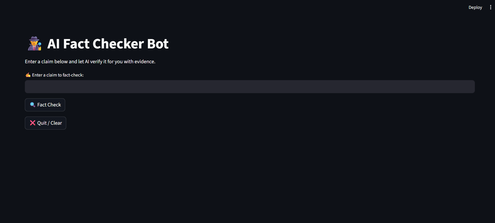
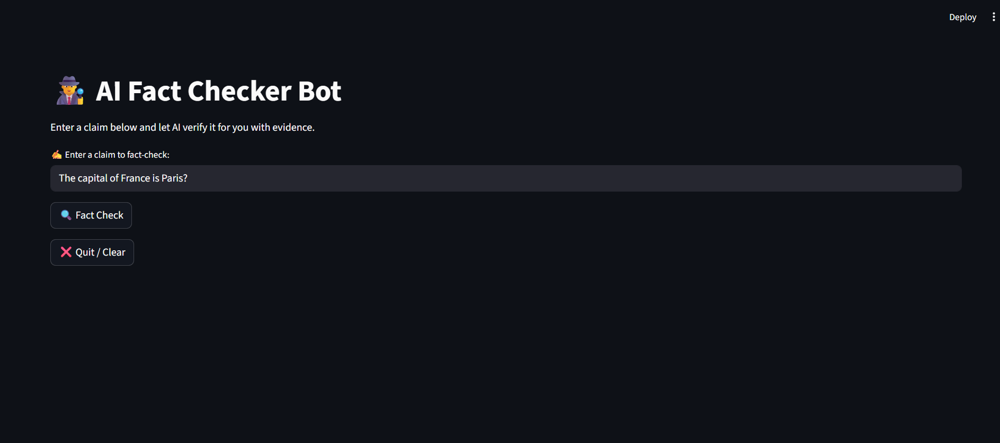
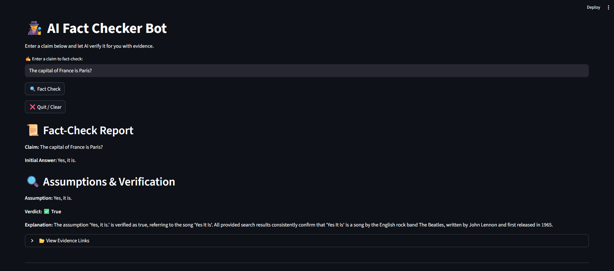

# AI Fact-Checker Bot

An intelligent fact-checking bot built with **LangChain**, **web search integration**, and **prompt chaining** to verify claims and provide accurate, evidence-backed answers.  
The bot uses advanced reasoning steps to identify assumptions, validate them with online sources, and synthesize a final verified response.

---

## 📌 Features

- **LangChain Integration** – Uses chat models like OpenAI GPT, Anthropic Claude, or open-source LLMs.
- **Prompt Chaining** – Breaks down claims into assumptions, verifies them, and refines answers.
- **Web Search** – Retrieves real-time information via DuckDuckGo or SerpAPI.
- **Multiple Interfaces** – Works with Streamlit, Gradio, or CLI.
- **Source Credibility Assessment** – Evaluates reliability based on domain authority & recency.
- **Claim Classification** – Categorizes claims as factual, opinion, mixed, or unverifiable.
- **Error Handling & Caching** – Graceful fallbacks for API errors and optimized repeated queries.

---

## 🛠️ Tech Stack

- **Python 3.10+**
- [LangChain](https://python.langchain.com/)
- [Streamlit](https://docs.streamlit.io/) / [Gradio](https://gradio.app/docs/)
- `duckduckgo-search` / `requests` / `beautifulsoup4`
- `python-dotenv` for API key management

## 📂 Project Structure
fact_checker_bot/
│── src/
│ ├── fact_checker.py # Main fact-checking logic
│ ├── prompt_chains.py # Prompt templates and chaining logic
│ ├── search_tools.py # Web search integration
│ ├── utils.py # Helper functions
│ └── ui/
│ ├── streamlit_app.py # Streamlit interface
│ ├── gradio_app.py # Gradio interface
│ └── cli.py # Command-line interface
│── config/
│ ├── prompts.yaml # Prompt templates
│ └── settings.py # Configurations
│── requirements.txt
│── main.py # Entry point
│── README.md
│── .env.example

---

## ⚙️ Installation

# Clone the repository
git clone https://github.com/your-username/ai-fact-checker-bot.git
cd ai-fact-checker-bot

# Create virtual environment
python -m venv venv
source venv/bin/activate   # For Linux/Mac
venv\Scripts\activate      # For Windows

# Install dependencies
pip install -r requirements.txt

# Set up environment variables
cp .env.example .env
# Add your API keys inside .env
---
#Usage 
streamlit run src/ui/streamlit_app.py

📸 Screenshots
## 📸 Screenshots

**Home Interface (Streamlit)**  

**Fact Verification Example**  

**Search Results Evidence View**  

##Future Improvements:

Multi-language support

Voice input/output

Batch fact-checking from uploaded documents

Integration with social media APIs for real-time claim detection

##  Acknowledgments

- [Nikhil Sharma](https://www.linkedin.com/in/-nikhil/) – Project concept and guidance  
- [LangChain Documentation](https://python.langchain.com/) – Framework reference  
- [Prompt Engineering Guide](https://www.promptingguide.ai/) – Prompt design best practices  
- [SerpAPI](https://serpapi.com/) – Web search integration

